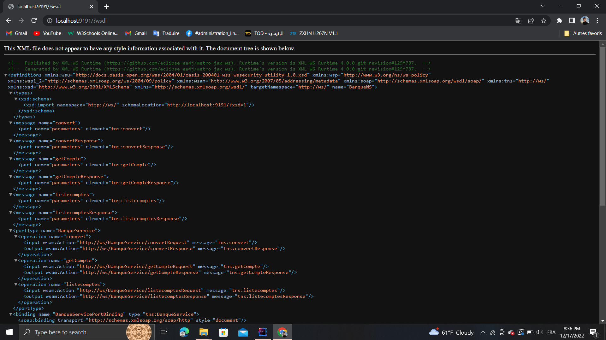
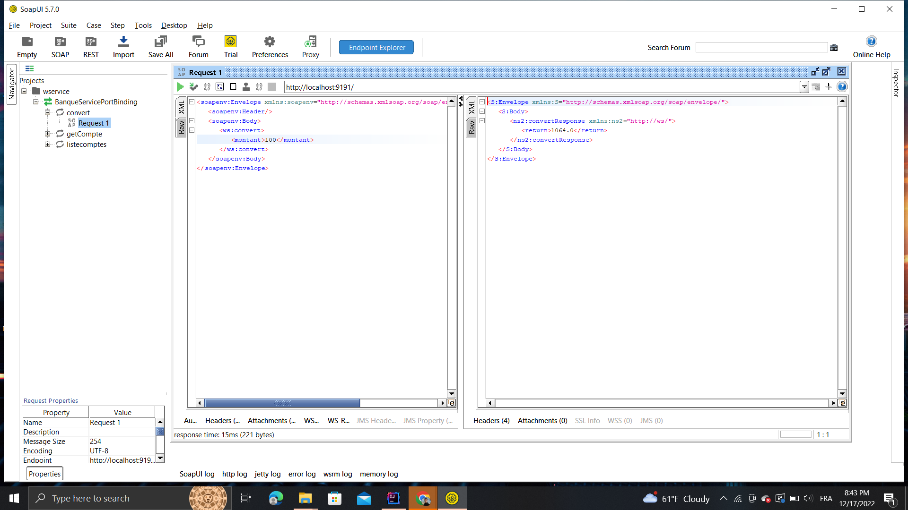
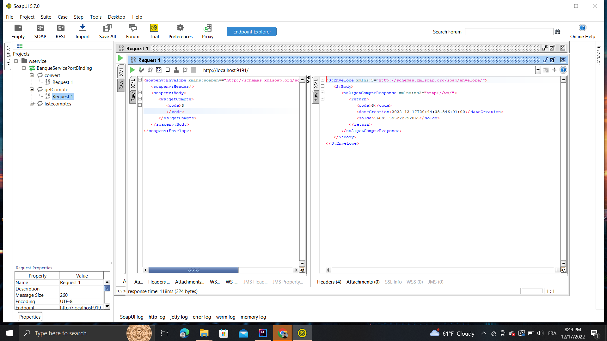
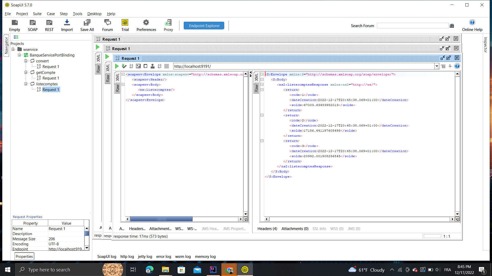
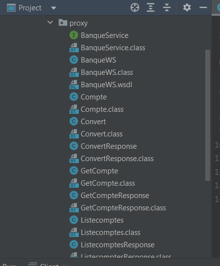
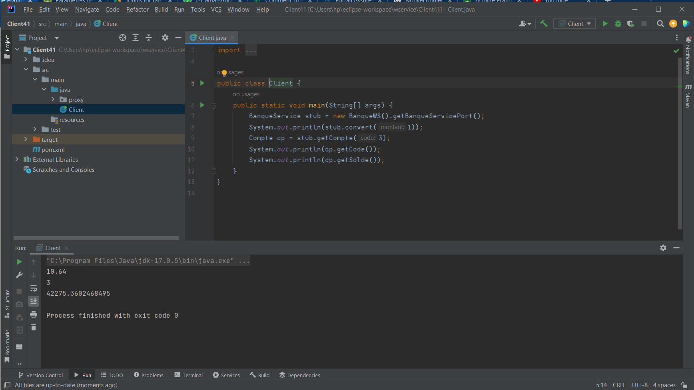

<!DOCTYPE html>
<html lang="en">
<head>
    
</head>
<body>
    <h1>WSDL</h1>
    

    
    <h1>test web  service avec soap ui </h1>
    
    
    
    <h1>consommation web service</h1>
    

    
    
    
    
</body>
</html>